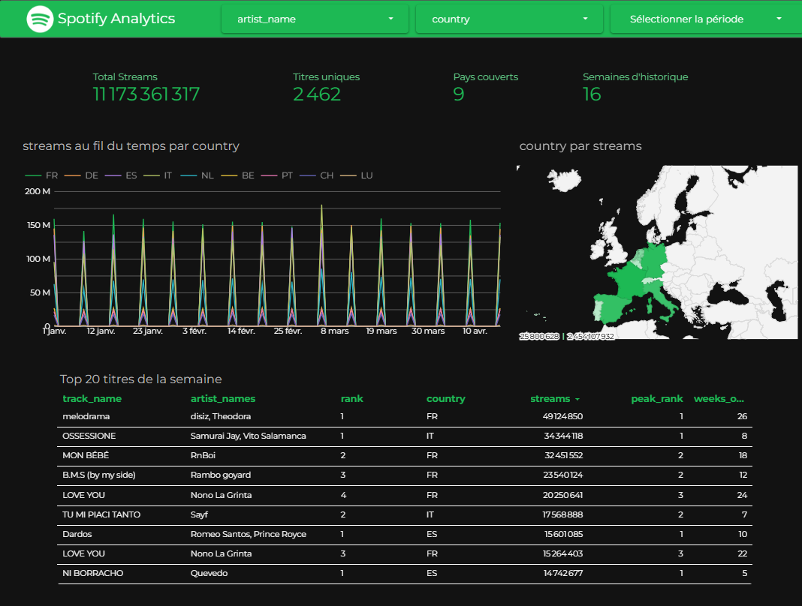
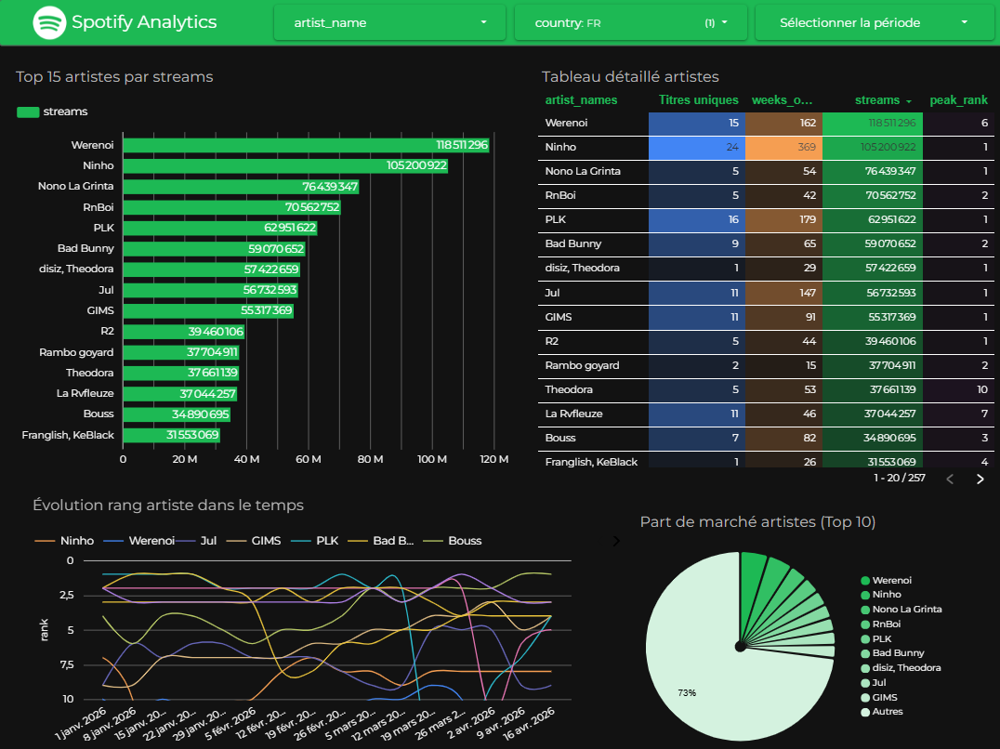
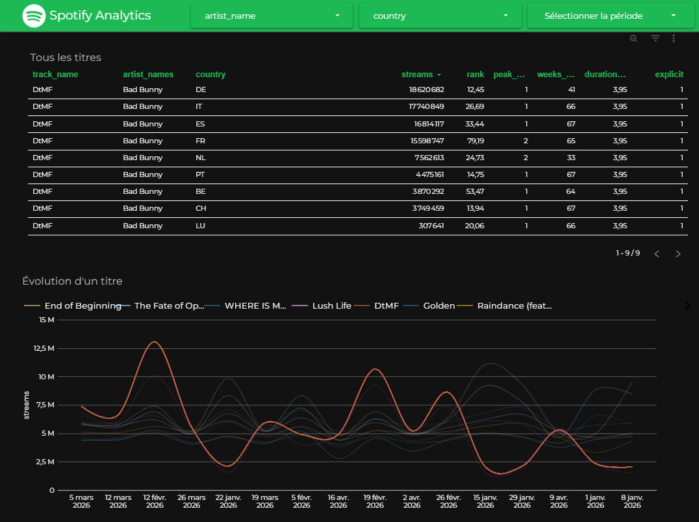
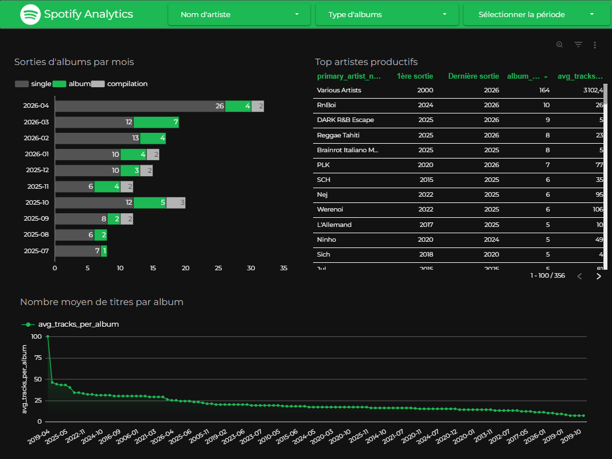
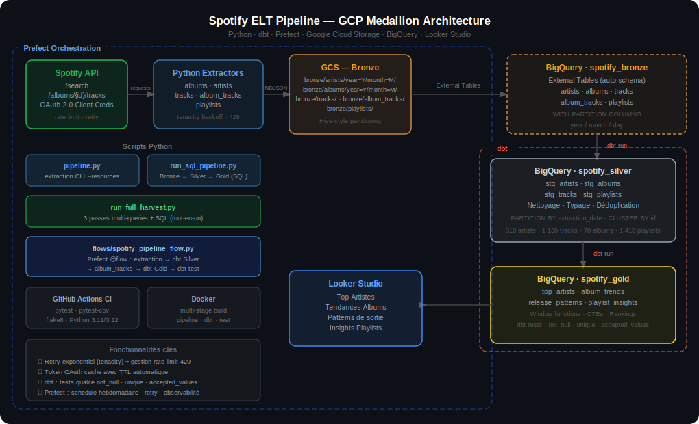

<div align="center">

# 🎵 Spotify ELT Pipeline

### Pipeline de données end-to-end sur GCP — Architecture Médaillon
### Python · dbt · Prefect · BigQuery · Looker Studio

[](https://www.python.org/)
[](https://www.getdbt.com/)
[](https://www.prefect.io/)
[](https://cloud.google.com/bigquery)
[](https://cloud.google.com/storage)
[](https://lookerstudio.google.com)
[](.github/workflows/ci.yml)
[](LICENSE)

[]()
[]()
[]()
[]()

**[📊 Voir le dashboard Looker →](https://datastudio.google.com/reporting/4dccc97d-d75a-4fc5-9701-f9db3cccd247)** · **[📖 Guide architecture](CLAUDE.md)** · **[🎨 Guide dashboard](looker/DASHBOARD_GUIDE.md)**

</div>

---

## 📸 Aperçu du dashboard

<div align="center">



</div>

<details>
<summary><b>📊 Voir les autres pages du dashboard</b></summary>

### 🎤 Top artistes


### 🎵 Top titres


### 📈 Tendances albums


</details>

---

## 🎯 Vue d'ensemble

Pipeline **ELT** complet pour analyser les tendances du streaming musical sur **9 marchés européens** (France, Allemagne, Espagne, Italie, Pays-Bas, Belgique, Portugal, Suisse, Luxembourg) en croisant **deux sources** :

- 🎧 **API Spotify Web** — métadonnées (artistes, albums, tracks, playlists)
- 📈 **Spotify Charts CSV** — **streams hebdomadaires réels** par pays

Le pipeline extrait, charge et transforme **11,17 milliards de streams** sur 16 semaines en métriques analytiques consommées par un dashboard Looker Studio interactif.

### ✨ Points forts du projet

| | |
|---|---|
| 🏗️ **Architecture Médaillon** | 3 couches Bronze → Silver → Gold sur BigQuery |
| 🔁 **Résilience** | OAuth token cache, retry exponentiel, gestion rate-limit 429 |
| 🧪 **Qualité** | 36 tests pytest + 25 tests dbt (not_null, unique, accepted_values) |
| ⚙️ **Orchestration** | Prefect 2.x, schedule hebdomadaire, retry par tâche |
| 📊 **Data modeling** | 9 modèles dbt + 6 vues Looker optimisées |
| 🚀 **CI/CD** | GitHub Actions : matrix Python 3.11/3.12, flake8 |
| 🐳 **Reproductibilité** | Docker Compose (5 services) |

---

## 📐 Architecture



```
┌──────────────────────── Prefect Flow (schedule lundi 06h UTC) ──────────────────────────┐
│                                                                                           │
│   ┌─────────────────┐                                                                    │
│   │ Spotify Web API │──► Python Extractors ──► GCS (NDJSON, Hive)                        │
│   │  /search        │    OAuth 2.0 + tenacity      │                                     │
│   │  /artists/{id}  │                              ▼                                     │
│   │  /albums/{id}   │                       BQ External Tables (spotify_bronze)          │
│   └─────────────────┘                              │                                     │
│                                                    │                                     │
│   ┌─────────────────┐                              │                                     │
│   │ Spotify Charts  │──► charts_loader.py ─────────┤                                     │
│   │ CSV hebdo       │    (INSERT rows)             │                                     │
│   └─────────────────┘                              ▼                                     │
│                                              dbt (run + test)                            │
│                                                    │                                     │
│                                                    ▼                                     │
│                                      spotify_silver (4 stg + charts)                     │
│                                                    │                                     │
│                                                    ▼                                     │
│                                      spotify_gold (5 modèles analytiques)                │
│                                                    │                                     │
│                                                    ▼                                     │
│                                      spotify_looker (6 vues optimisées)                  │
│                                                    │                                     │
└────────────────────────────────────────────────────┼──────────────────────────────────────┘
                                                     ▼
                                              Looker Studio
                                         Dashboard 5 pages · Europe
```

---

## 🧰 Stack technique

| Couche | Technologie | Rôle |
|---|---|---|
| **Ingestion** | Python 3.11+ · requests · tenacity | Extraction API + CSV, OAuth token cache, retry exponentiel |
| **Storage** | Google Cloud Storage | Data lake Bronze (NDJSON partitionné Hive) |
| **Warehouse** | BigQuery (EU) | 4 datasets : bronze, silver, gold, looker |
| **Transformation** | **dbt-bigquery 1.11** | 9 modèles SQL versionnés + 25 tests qualité |
| **Orchestration** | **Prefect 2.x** | Flow schedulé, retry par tâche, UI observabilité |
| **Visualisation** | Looker Studio | Dashboard 5 pages avec thème Spotify |
| **Tests** | pytest (36 tests) | Coverage ~69%, mocks requests/google-cloud |
| **CI/CD** | GitHub Actions | Matrix Python 3.11 + 3.12, flake8 |
| **Conteneurisation** | Docker + Compose | 5 services (pipeline, dbt, flow, test, sql) |

---

## 📁 Structure du projet

```
spotify-elt-pipeline/
│
├── pipeline.py                      # CLI d'extraction — python pipeline.py --resources albums artists
├── config.py                        # Validation fail-fast des variables d'env
├── CLAUDE.md                        # Guide architecture pour agents IA
│
├── auth/spotify_auth.py             # OAuth 2.0 Client Credentials + cache TTL
│
├── extractors/                      # Un extracteur par endpoint Spotify
│   ├── base_extractor.py            # Pagination, retry, normalisation dates
│   ├── albums_extractor.py          # /search?type=album
│   ├── artists_extractor.py         # /search?type=artist
│   ├── tracks_extractor.py          # /search?type=track
│   ├── artist_albums_extractor.py   # /artists/{id}/albums (nécessite Silver)
│   ├── album_tracks_extractor.py    # /albums/{id}/tracks (nécessite Silver)
│   └── playlists_extractor.py       # /search?type=playlist
│
├── transformers/ndjson_transformer.py   # Serialize dict → NDJSON bytes
├── loaders/
│   ├── gcs_loader.py                # Upload GCS partitionné Hive (year/month/day)
│   └── charts_loader.py             # CSV Spotify Charts → BQ spotify_silver.spotify_charts
│
├── charts/                          # CSV Spotify Charts — regional-{pays}-weekly-YYYY-MM-DD.csv
│
├── dbt/                             # ══ Transformations dbt ══
│   ├── dbt_project.yml              # Config datasets + matérialisations
│   ├── profiles.yml                 # Auth BigQuery (oauth dev / service-account prod)
│   ├── macros/generate_schema_name.sql   # Override : +schema produit le dataset tel quel
│   └── models/
│       ├── sources.yml              # Déclaration 5 tables Bronze
│       ├── schema.yml               # 25 tests qualité
│       ├── silver/                  # 4 stg_* + spotify_charts
│       └── gold/                    # 5 modèles analytiques
│
├── looker/                          # ══ Looker Studio ══
│   ├── create_looker_views.py       # Déploie 6 vues optimisées dans spotify_looker
│   ├── looker_views.sql             # SQL référence (lecture humaine)
│   └── DASHBOARD_GUIDE.md           # Guide A→Z : sources, widgets, thème
│
├── flows/spotify_pipeline_flow.py   # Flow Prefect (8 phases)
│
├── tests/                           # 36 tests pytest
├── docs/                            # Diagramme + screenshots
├── .github/workflows/ci.yml         # Tests matrix Python + flake8
├── Dockerfile · docker-compose.yml · prefect.yaml
└── requirements.txt · .env.example · LICENSE
```

---

## 🗄️ Modèle de données

### Bronze — données brutes (GCS → External Tables BigQuery)

Chaque record est enrichi automatiquement :

| Champ | Type | Description |
|---|---|---|
| `_extraction_timestamp` | TIMESTAMP | Horodatage UTC |
| `_extraction_date` | DATE | Partition Hive |
| `_market` | STRING | Marché (ex: FR) |

### Silver — nettoyage + déduplication (dbt)

| Modèle | Logique clé | Ligne |
|---|---|---|
| `stg_artists` | `ROW_NUMBER() OVER (PARTITION BY id ORDER BY extraction_timestamp DESC)` pour dédup | 471 |
| `stg_albums` | Normalisation dates partielles Spotify (`"1997"` → `"1997-01-01"` via SAFE.PARSE_DATE) | 214 |
| `stg_tracks` | `UNION ALL` de `bronze.tracks` + `bronze.album_tracks` (couverture maximale) | 2 215 |
| `stg_playlists` | Dédup + extraction `track_count` | 2 698 |
| `spotify_charts` | Chargé par `charts_loader.py` depuis CSV | 9 200 |

### Gold — analytics (dbt)

| Modèle | Description | Window Functions |
|---|---|---|
| `top_artists` | Métriques activité artiste | — |
| `album_trends` | Volume sorties + cumul annuel | `SUM(...) OVER (PARTITION BY year ORDER BY month)` |
| `release_patterns` | Saisonnalité + cadence | `DATE_DIFF` sur min/max releases |
| `playlist_insights` | Segmentation par taille | `APPROX_QUANTILES(track_count, 2)` pour la médiane |
| **`track_streams`** | **Jointure charts + métadonnées** | `SUM(streams) OVER (PARTITION BY track_id, country ORDER BY chart_date)` |

### Looker — vues optimisées (déployées par `create_looker_views.py`)

6 vues dans `spotify_looker` avec champs calculés pré-calculés (`streams_m`, `rank_bucket`, `month_label`).

---

## 🚀 Installation

### Prérequis

- **Python 3.11+** (extraction) **et Python 3.12** (dbt — `mashumaro` incompatible avec 3.14)
- Compte [Google Cloud Platform](https://cloud.google.com) : GCS + BigQuery activés en région **EU**
- App [Spotify Developer](https://developer.spotify.com/dashboard) (Client ID + Secret)
- `gcloud` CLI : `gcloud auth application-default login`

### Étapes

```bash
# 1. Cloner
git clone https://github.com/AbdessamadAouissi/spotify-elt-pipeline.git
cd spotify-elt-pipeline

# 2. Deux venvs (séparation des dépendances)
python -m venv .venv                                # extraction + loaders + tests
py -3.12 -m venv .venv_dbt                          # dbt (Python 3.12)

# Windows
.venv\Scripts\activate
pip install -r requirements.txt
deactivate
.venv_dbt\Scripts\activate
pip install dbt-bigquery

# 3. Variables d'environnement
cp .env.example .env
# Éditer .env : SPOTIFY_CLIENT_ID, SPOTIFY_CLIENT_SECRET, GCP_PROJECT_ID, GCS_BUCKET_NAME
```

---

## ⚙️ Configuration

```env
# Spotify API
SPOTIFY_CLIENT_ID=your_spotify_client_id
SPOTIFY_CLIENT_SECRET=your_spotify_client_secret

# GCP
GCP_PROJECT_ID=your_gcp_project_id
GCS_BUCKET_NAME=your_gcs_bucket_name
GCS_BRONZE_PREFIX=bronze

# BigQuery (datasets créés automatiquement)
BIGQUERY_DATASET_BRONZE=spotify_bronze
BIGQUERY_DATASET_SILVER=spotify_silver
BIGQUERY_DATASET_GOLD=spotify_gold

# Paramètres extraction
SPOTIFY_SEARCH_QUERY=year:2020-2026
SPOTIFY_SEARCH_QUERY_ARTISTS=rap francais
SPOTIFY_SEARCH_QUERY_PLAYLISTS=rap francais
SPOTIFY_MARKET=FR
MAX_PAGES=10
```

> 🔒 `.env` est dans `.gitignore` — jamais commité.

---

## 🎬 Utilisation

### Extraction Spotify API → GCS Bronze

```bash
.venv\Scripts\activate
python pipeline.py                                  # toutes les ressources
python pipeline.py --resources albums artists      # ressources spécifiques
```

### Charger Spotify Charts CSV → Silver

```bash
# 1. Télécharger les CSV sur https://charts.spotify.com
# 2. Déposer dans charts/ (format: regional-fr-weekly-2026-04-09.csv)
python loaders/charts_loader.py --charts-dir charts/
```

### Transformer avec dbt

```bash
.venv_dbt\Scripts\activate
cd dbt
set GCP_PROJECT_ID=your_project      # Windows
# export GCP_PROJECT_ID=...          # Unix

dbt run                              # tous les modèles
dbt run --select gold.track_streams  # un seul modèle
dbt test                             # 25 tests qualité
```

### Déployer les vues Looker Studio

```bash
.venv\Scripts\activate
GCP_PROJECT_ID=your_project python looker/create_looker_views.py
```

### Pipeline complet orchestré (Prefect)

```bash
# Run local
python flows/spotify_pipeline_flow.py

# UI Prefect : http://localhost:4200
prefect server start
prefect deploy --all
```

---

## 🧪 Tests

```bash
pytest                                         # 36 tests, ~2s
pytest --cov=. --cov-report=term-missing       # coverage ~69%
```

| Fichier | Tests | Couverture |
|---|---|---|
| `test_transformer.py` | 8 | Sérialisation NDJSON, dates, champs manquants |
| `test_auth.py` | 6 | Cache token OAuth, refresh, expiration |
| `test_base_extractor.py` | 9 | Pagination, retry, RateLimitError, enrichissement |
| `test_config.py` | 8 | Validation variables d'env (fail-fast) |
| `test_gcs_loader.py` | 5 | Génération chemins Hive GCS |

**Tests dbt (25) :**

| Type | Cibles |
|---|---|
| `not_null` | id, name, extraction_date sur tous les Silver |
| `unique` | id sur stg_artists, stg_albums, stg_tracks, stg_playlists, top_artists |
| `accepted_values` | `album_type ∈ {album, single, compilation}` · `size_bucket ∈ {micro, small, medium, large, mega}` |

---

## 🐳 Docker

```bash
docker compose run pipeline    # Extraction complète
docker compose run dbt         # dbt run + test
docker compose run flow        # Prefect flow
docker compose run test        # pytest
```

---

## 📊 Dashboard Looker Studio

**[🔗 Voir le dashboard live →](https://lookerstudio.google.com)**

### Structure (5 pages)

| # | Page | Widgets clés |
|---|---|---|
| 1 | 📈 Vue d'ensemble Streams | 4 KPIs · Carte géo · Courbe temporelle · Tableau Top 20 |
| 2 | 🎤 Top Artistes | Bar chart horizontal · Camembert part de marché · Tableau détaillé |
| 3 | 🎵 Top Titres | Tableau paginé 200 lignes · Évolution Top 5 dans le temps |
| 4 | 💿 Tendances Albums | Barres empilées par type · Longueur moyenne des albums |
| 5 | 📝 Playlists | Donut segmentation · Analyse par taille |

### Thème Spotify
- 🎨 Fond `#121212` · Accent `#1DB954` · Police **Montserrat**
- Filtres globaux : pays (FR/IT) · période · type chart

Guide complet de construction : **[`looker/DASHBOARD_GUIDE.md`](looker/DASHBOARD_GUIDE.md)**

---

## 📈 Résultats

Données actuelles (Europe — 9 pays, 16 semaines de charts, 2020–2026) :

### Volumétrie

| Couche | Table | Lignes |
|---|---|---:|
| 🥉 Silver | `stg_artists` | 2 440 |
| 🥉 Silver | `stg_albums` | 713 |
| 🥉 Silver | `stg_tracks` | 2 407 |
| 🥉 Silver | `stg_playlists` | 3 802 |
| 🥉 Silver | `spotify_charts` | 28 799 |
| 🥇 Gold | `top_artists` | 2 440 |
| 🥇 Gold | `album_trends` | 587 |
| 🥇 Gold | `release_patterns` | 643 |
| 🥇 Gold | `playlist_insights` | 8 |
| 🥇 Gold | **`track_streams`** | **28 799** |

### Couverture streams par pays

| Pays | Semaines | Streams cumulés |
|---|---:|---:|
| 🇫🇷 France | 16 | **2,45 Md** |
| 🇩🇪 Allemagne | 16 | **2,28 Md** |
| 🇪🇸 Espagne | 16 | **2,16 Md** |
| 🇮🇹 Italie | 16 | **2,05 Md** |
| 🇳🇱 Pays-Bas | 16 | **1,11 Md** |
| 🇧🇪 Belgique | 16 | **0,42 Md** |
| 🇵🇹 Portugal | 16 | **0,38 Md** |
| 🇨🇭 Suisse | 16 | **0,29 Md** |
| 🇱🇺 Luxembourg | 16 | **0,03 Md** |
| **Total** | | **🎯 11,17 milliards** |

---

## 🎓 Ce que ce projet illustre

- **Architecture Médaillon** rigoureuse avec séparation claire des responsabilités
- **ELT moderne** : transformation dans le warehouse (BigQuery) plutôt qu'en amont
- **Data modeling** avec window functions BigQuery (cumulative, parts, percentiles)
- **Résilience production** : retry, rate limiting, normalisation de données imparfaites
- **Qualité as code** : 25 tests dbt + 36 tests Python en CI
- **Orchestration** : Prefect avec dépendances, retry par tâche, schedule
- **Observabilité** : logs structurés, résumé par ressource en fin de run
- **Documentation** : README, CLAUDE.md (guide IA), dashboard guide A→Z

---

## 🔧 Troubleshooting

<details>
<summary><b>dbt échoue avec "mashumaro UnserializableField"</b></summary>

Python 3.14 est incompatible avec dbt. Utilisez Python 3.12 dans `.venv_dbt` :
```bash
py -3.12 -m venv .venv_dbt
.venv_dbt\Scripts\activate
pip install dbt-bigquery
```
</details>

<details>
<summary><b>dbt crée des datasets nommés "spotify_silver_spotify_gold"</b></summary>

Le macro `dbt/macros/generate_schema_name.sql` override ce comportement. Si absent, dbt concatène `default_schema + custom_schema`.
</details>

<details>
<summary><b>Spotify /artists renvoie 403 Forbidden</b></summary>

Depuis 2023, l'endpoint `/artists?ids=...` est restreint aux apps avec utilisateur connecté (OAuth Authorization Code). Les apps Client Credentials n'ont plus accès à `popularity`, `followers`, `genres`. Les colonnes correspondantes ont été retirées des modèles.
</details>

<details>
<summary><b>BigQuery rejette des dates comme "1997"</b></summary>

Spotify retourne parfois des dates partielles. Les tables externes Bronze utilisent `release_date STRING` (schéma explicite) et les modèles Silver normalisent via `SAFE.PARSE_DATE('%Y-%m-%d', CASE WHEN REGEXP_CONTAINS(...) THEN ...)`.
</details>

<details>
<summary><b>Rate limiting 429 sur /artists/{id}/albums</b></summary>

Les extracteurs `artist_albums` et `album_tracks` ajoutent un délai (1,2 s et 0,5 s respectivement) entre chaque ID pour rester sous les limites Spotify. Le retry exponentiel (tenacity) prend le relais si un 429 survient quand même.
</details>

---

## 📄 Licence

MIT © [Abdessamad Aouissi](https://github.com/AbdessamadAouissi)

---

<div align="center">

**Si ce projet vous a été utile, n'hésitez pas à mettre une ⭐ sur le repo !**

</div>
